# 🐘 WatchWise Big Data Analytics (BDA) Guide
## Real-Time Clickstream Ingestion with Apache Flume & Hadoop HDFS

This project implements an end-to-end **Big Data Analytics (BDA)** pipeline for the WatchWise movie platform. It captures user interaction events (movie clicks, search queries, AI recommendations, reviews, watchlist/favorites) and ingests them into **Hadoop Distributed File System (HDFS)** using **Apache Flume**.

---

## 🏛️ System Architecture

```mermaid
graph LR
    A[Web Client / App UI] -->|Clicks & Searches| B[Node.js Express Backend]
    B -->|Structured JSON Logs| C[user_activity.log]
    B -.->|TCP Socket 44444| D[Flume Netcat Source]
    C -->|Taildir / SpoolDir Source| E[Apache Flume Agent]
    D --> E
    E -->|In-Memory Buffer| F[Flume Memory Channel]
    F -->|Time & Size Partitioned| G[HDFS Sink]
    G -->|Block Storage| H[(Hadoop HDFS Cluster)]
    H -->|Batch MapReduce| I[analyze_clickstream.py]
    I -->|Top Trends & Metrics| J[BDA Dashboard UI]
```



### 1. Ingestion Pipeline Stages

| Component | Technology | Responsibility |
|-----------|------------|----------------|
| **Data Producer** | Express.js (`bda/flume_collector.js`) | Generates structured JSON clickstream records for every user interaction |
| **Flume Source** | `TAILDIR` / `NetcatSource` | Streams changes from `user_activity.log` and TCP port `44444` |
| **Flume Channel** | `MemoryChannel` | High-throughput, non-blocking in-memory queue (Capacity: 10,000 events) |
| **Flume Sink** | `HDFSEventSink` | Writes partitioned log files to `hdfs://localhost:9000/watchwise/clickstream/%Y-%m-%d/` |
| **Analytics Engine** | Python / MapReduce | Aggregates most viewed films, genre trends, and search frequency |

---

## ⚙️ Apache Flume Configuration (`bda/flume/flume-hdfs.conf`)

```properties
# Define Agent Components
watchwise_agent.sources = r1
watchwise_agent.channels = c1
watchwise_agent.sinks = k1

# Source: Taildir source watching activity logs
watchwise_agent.sources.r1.type = TAILDIR
watchwise_agent.sources.r1.positionFile = bda/flume/taildir_position.json
watchwise_agent.sources.r1.filegroups = f1
watchwise_agent.sources.r1.filegroups.f1 = bda/logs/flume_source/user_activity.*log
watchwise_agent.sources.r1.interceptors = i1
watchwise_agent.sources.r1.interceptors.i1.type = timestamp

# Channel: In-memory queue
watchwise_agent.channels.c1.type = memory
watchwise_agent.channels.c1.capacity = 10000
watchwise_agent.channels.c1.transactionCapacity = 1000

# Sink: Hadoop HDFS Sink
watchwise_agent.sinks.k1.type = hdfs
watchwise_agent.sinks.k1.hdfs.path = hdfs://localhost:9000/watchwise/clickstream/%Y-%m-%d/
watchwise_agent.sinks.k1.hdfs.filePrefix = events-
watchwise_agent.sinks.k1.hdfs.fileSuffix = .log
watchwise_agent.sinks.k1.hdfs.fileType = DataStream
watchwise_agent.sinks.k1.hdfs.writeFormat = Text
watchwise_agent.sinks.k1.hdfs.rollInterval = 30
watchwise_agent.sinks.k1.hdfs.rollSize = 1048576
watchwise_agent.sinks.k1.hdfs.rollCount = 100
watchwise_agent.sinks.k1.hdfs.useLocalTimeStamp = true

# Bindings
watchwise_agent.sources.r1.channels = c1
watchwise_agent.sinks.k1.channel = c1
```

---

## 🚀 How to Run the BDA Pipeline

### Option A: Instant Live Demo (Zero Installation Required)
WatchWise includes an **active resilient BDA simulator** that generates live HDFS partitioned files (`bda/data/hdfs/clickstream/YYYY-MM-DD/`) and streams events in real-time.

1. **Start the Web App**:
   ```bash
   # Terminal 1: ML Engine
   python backend/ml_service.py

   # Terminal 2: Node.js Backend
   cd backend && npm start
   ```

2. **Open the BDA Tab in Browser**:
   - Go to `http://localhost:5000`
   - Click **"BDA Flume"** in the top navigation bar.
   - Click **"Simulate Clickstream Batch (25 Events)"** to ingest high-velocity data.
   - Click **"Run HDFS MapReduce Analytics"** to see live aggregations.

3. **Run the MapReduce CLI Processing Job**:
   ```bash
   python bda/analytics/analyze_clickstream.py
   ```

---

### Option B: Run Real Hadoop + Apache Flume in Docker (1 Command)
If you have Docker installed on your computer, you can run a 100% genuine Hadoop HDFS cluster and Flume container:

```bash
# Start Hadoop NameNode, DataNode, and Flume container
docker-compose -f bda/docker-compose.bda.yml up -d
```

- **Hadoop HDFS Web UI**: [http://localhost:9870](http://localhost:9870)
- **HDFS DataNode**: [http://localhost:9864](http://localhost:9864)
- **Flume Ingestion Port**: `localhost:44444`

Verify ingested files in HDFS:
```bash
docker exec -it watchwise_hdfs_namenode hdfs dfs -ls /watchwise/clickstream/
```

---

### Option C: Native Apache Flume on Linux / WSL / Ubuntu

1. **Install Java 8 or 11**:
   ```bash
   sudo apt update && sudo apt install -y openjdk-11-jdk
   ```

2. **Download & Extract Apache Flume**:
   ```bash
   wget https://archive.apache.org/dist/flume/1.11.0/apache-flume-1.11.0-bin.tar.gz
   tar -xzvf apache-flume-1.11.0-bin.tar.gz
   export FLUME_HOME=$(pwd)/apache-flume-1.11.0-bin
   export PATH=$PATH:$FLUME_HOME/bin
   ```

3. **Launch the WatchWise Flume Agent**:
   ```bash
   flume-ng agent \
     --conf ./bda/flume \
     --conf-file ./bda/flume/flume-hdfs.conf \
     --name watchwise_agent \
     -Dflume.root.logger=INFO,console
   ```

---

## 🎯 Big Data Analytics Viva / Evaluation Q&A

### 1. What role does Apache Flume play in Big Data architecture?
**Answer**: Flume acts as the **Data Ingestion Layer**. Instead of web servers directly writing to HDFS (which degrades web performance and creates small file issues on the NameNode), Flume collects, buffers in channels, and batches stream data reliably into distributed storage.

### 2. Why use a Memory Channel versus a File Channel in Flume?
**Answer**:
- **Memory Channel**: Stores events in RAM. Provides extremely high throughput and low latency, ideal for high-frequency clickstream data.
- **File Channel**: Backed by disk. Offers data durability across agent restarts at the cost of disk I/O latency.

### 3. How does Flume solve the Hadoop "Small Files Problem"?
**Answer**: Through rollover parameters (`rollInterval`, `rollSize`, `rollCount`). Flume holds small streaming events in its channel and flushes them into larger HDFS blocks (e.g., 64MB or 128MB) rather than creating a separate file per HTTP request.

### 4. What is the MapReduce flow in `analyze_clickstream.py`?
**Answer**:
- **Mapper Phase**: Parses raw JSON logs across all HDFS partition blocks, extracting `(title, 1)`, `(genre, 1)`, and `(query, 1)` tuples.
- **Reducer Phase**: Aggregates counts by key to determine trending topics, popularity scores, and engagement rates.
